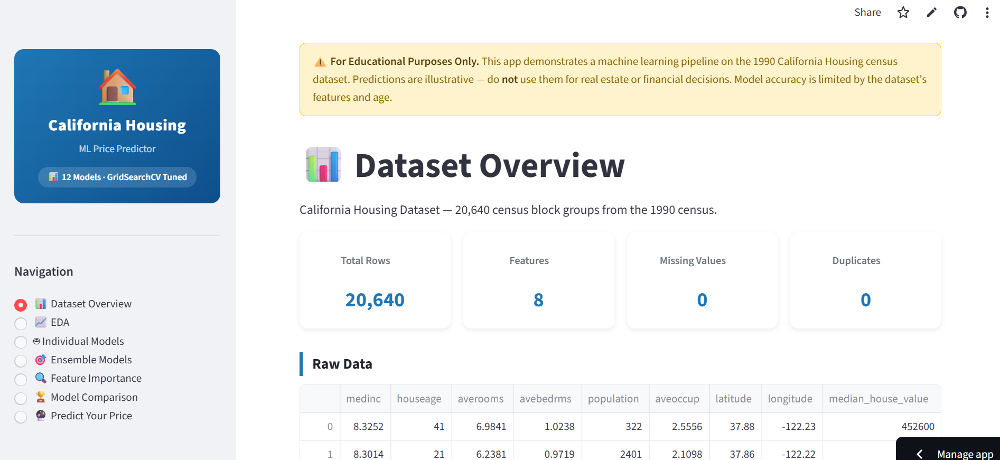
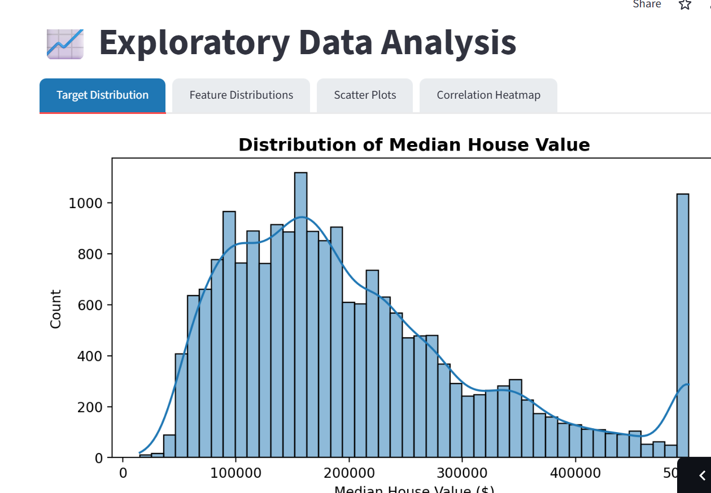
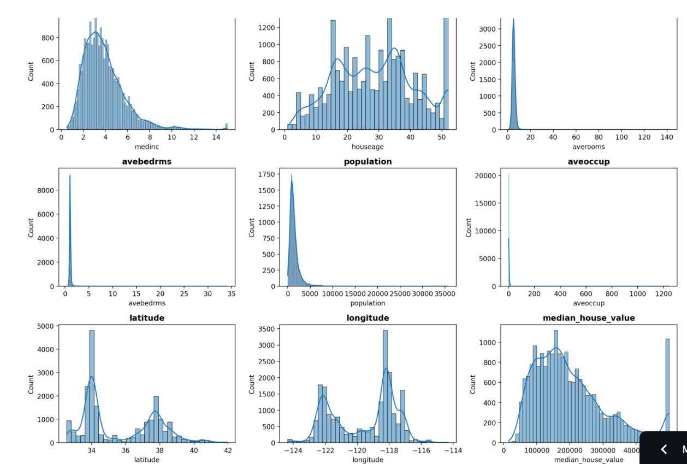
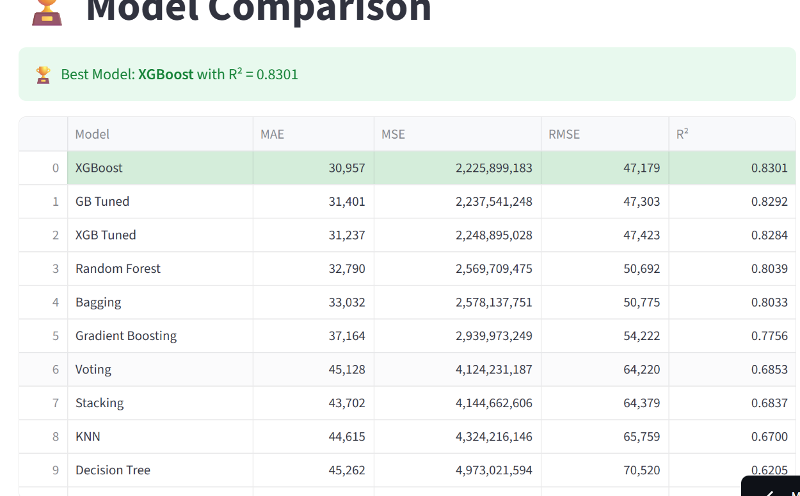
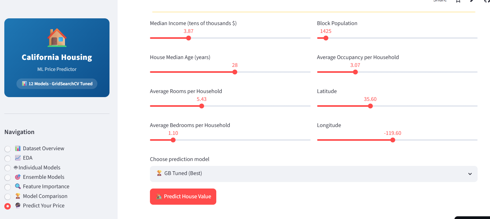
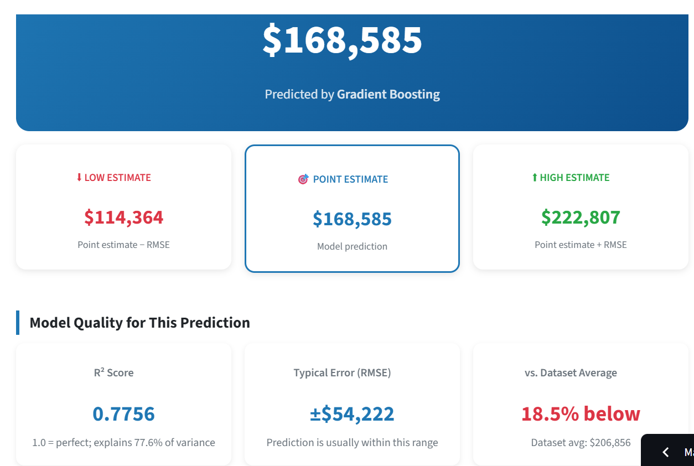

# 🏠 California Housing Price Prediction


A complete machine learning pipeline to predict California housing prices using regression models and ensemble techniques.

---
## Live Demo

https://california-housing-price-prediction-ml.streamlit.app/

## 📌 Table of Contents
1. [Project Overview](#-project-overview)
2. [Dataset](#-dataset)
3. [Project Architecture](#-project-architecture)
4. [Data Preprocessing & EDA](#-data-preprocessing--eda)
5. [Models](#-models)
6. [Ensemble Learning](#-ensemble-learning)
7. [Evaluation Metrics](#-evaluation-metrics)
8. [Results](#-results)
9. [Feature Importance](#-feature-importance)
10. [Key Insights](#-key-insights)
11. [Technologies Used](#-technologies-used)
12.  [🌐 Streamlit Web App](#-streamlit-web-app)
13. [Future Work](#-future-work)

---

## 📖 Project Overview

This project predicts the **median house value** of California neighbourhood blocks using the 1990 Census dataset. The pipeline covers data cleaning, exploratory analysis, feature engineering, seven individual regression models, seven ensemble methods, and cross-validation — with a final comparison of all models using standard regression metrics.

---

## Dataset

**Source:** [California Housing Prices — Kaggle](https://www.kaggle.com/datasets/camnugent/california-housing-prices)
**Size:** 20,640 rows × 10 columns

| Feature | Description |
|---|---|
| `longitude` / `latitude` | Geographic coordinates of the housing block |
| `housing_median_age` | Median age of houses in the block |
| `total_rooms` / `total_bedrooms` | Room and bedroom counts across the block |
| `population` / `households` | Population and household count in the block |
| `median_income` | Median household income (in $10,000s) |
| `ocean_proximity` | Categorical — distance from the ocean (5 levels) |
| **`median_house_value`** | **Target variable — median house price in USD** |

---

## 🏗️ Project Architecture

```
Data Acquisition (Kaggle)
        │
        ▼
Exploratory Data Analysis
        │
        ▼
Preprocessing
(Missing values → Duplicates → Type checks)
        │
        ▼
Feature Engineering & Scaling
(One-Hot Encoding → Train/Test Split 80/20 → StandardScaler)
        │
        ├──────────────┬──────────────┐
        ▼              ▼              ▼
  Linear Models   Tree Models   Distance/Kernel
  Linear Reg.     Decision Tree  KNN (k=5)
  Polynomial      Random Forest  SVR (RBF)
  Lasso (L1)      Gradient Boost
  Multiple LR     AdaBoost
                  XGBoost
        │
        ▼
Ensemble Learning
(Voting · Bagging · Random Forest · Gradient Boosting · AdaBoost · XGBoost · Stacking)
        │
        ▼
Evaluation
(MAE · MSE · RMSE · R² · Adjusted R² · 5-Fold CV)
        │
        ▼
Feature Importance + Business Insights
```

---

##  Data Preprocessing & EDA

**Missing Values:** The `total_bedrooms` column has ~207 nulls (~1%). These are filled with the column mean — a safe approach for such a small gap.

**Duplicate Removal:** Duplicate rows are removed to prevent the model from memorising repeated entries.

**EDA Findings:**
- The target (`median_house_value`) is right-skewed with an artificial cap at $500K.
- Features like `total_rooms` and `population` are heavily right-skewed — a few very dense blocks dominate.
- The scatter plot of `median_income` vs `median_house_value` shows a strong positive but non-linear relationship, justifying tree-based and polynomial models.

**Feature Engineering:**
- `ocean_proximity` is one-hot encoded into 4 binary columns (drop_first to avoid multicollinearity).
- All features are standardised using `StandardScaler` — critical for KNN and SVR which are distance/margin-sensitive. The scaler is fit only on training data to prevent leakage.

---

## Models

### Linear Regression
Fits a straight line between features and house price. Applied first with only `median_income` (single-feature) to visualise the relationship, then with all features (Multiple LR). Simple and interpretable but cannot capture non-linear patterns.

### Polynomial Regression (Degree 2)
Adds squared terms of `median_income` to model curvature. The resulting curve fits the income–price scatter better than a straight line, confirming the non-linear nature of the relationship.

### Lasso Regression (L1)
Linear regression with an L1 penalty that can shrink less-important feature coefficients to exactly zero, performing automatic feature selection. Uses `alpha=0.1` for moderate regularisation.

### Multiple Linear Regression
Uses all features simultaneously. Also computes **Adjusted R²** which penalises for unnecessary features — fairer than plain R² when comparing models with different feature counts.

### Decision Tree Regressor
Partitions the feature space into regions through binary splits. Predictions are step-like (constant within each leaf region). Captures non-linearity naturally but overfits without depth constraints.

### KNN Regressor (k=5)
Predicts house value by averaging the 5 most similar training examples by Euclidean distance. Locally adaptive but computationally expensive and sensitive to feature scaling.

### Support Vector Regression (SVR — RBF Kernel)
Uses the RBF kernel to model non-linear relationships by implicitly mapping data into a higher-dimensional space. Robust to outliers; requires careful tuning and is slower on large datasets.

---

##  Ensemble Learning

### Voting Regressor
Combines Linear Regression, Lasso, Decision Tree, SVR, and KNN by **simple averaging**. Benefits from the diversity of model types but is limited by equal weighting — it cannot learn that some models are better than others.

### Bagging Regressor
**Formula:**
$$
\hat{y}_{\text{bag}} = \frac{1}{B} \sum_{b=1}^{B} f_b(x)
$$

Where each $f_b$ is trained on a bootstrap sample $D_b$ drawn with replacement from $D$.

**How it works:**
1. Draw $B = 100$ bootstrap samples (random rows with replacement) from training data
2. Train a Decision Tree on each sample independently
3. Average all 100 tree predictions

**Why it reduces error:** Each tree overfits to its bootstrap sample, but their errors are uncorrelated — averaging cancels out variance while preserving the signal.

**Bias-Variance decomposition:**
$$\text{Error} = \text{Bias}^2 + \text{Variance} + \text{Noise}$$

Bagging specifically targets **Variance reduction**.

**In this project:** R² ≈ 0.282. Lower than boosting because averaging uncorrected trees is less powerful than sequential error correction.


### Random Forest
Extends Bagging by also randomising which features each tree considers at each split, further decorrelating the trees. Also used for **feature importance analysis** in this project.

### Gradient Boosting
Builds trees **sequentially** — each new tree corrects the residual errors of all previous trees. This iterative error correction makes it highly effective on complex tabular data and is the **best-performing model** in this project.

### AdaBoost
Sequential boosting that **re-weights training samples** — examples with high prediction error get more weight in the next round, forcing the model to focus on hard cases. Ranked third overall.

### XGBoost
An optimised gradient boosting implementation with built-in L1/L2 regularisation, faster parallel training, and native missing value handling. Nearly identical performance to Gradient Boosting and preferred in production due to speed and tuning flexibility.

### Stacking Regressor
A two-level ensemble: five base models (LR, DT, KNN, SVR, Lasso) generate predictions, and a **Random Forest meta-model** learns the optimal way to combine them. More sophisticated than voting but benefits most when base models are individually well-tuned.

---
## 📐 Evaluation Metrics

### 1. Mean Absolute Error (MAE)

$$\text{MAE} = \frac{1}{n}\sum_{i=1}^{n}|y_i - \hat{y}_i|$$

**What it measures:** The average absolute difference between actual and predicted house prices in dollars.

**Interpretation in this project:**
- MAE of **$60,000** means predictions are off by $60,000 on average
- Uses absolute value — so over-predictions and under-predictions cancel each other out equally
- **Outlier-robust** — a single $1M prediction error doesn't inflate MAE the way it inflates RMSE

**When to prefer MAE:** When large errors are not disproportionately worse than small ones (e.g. a $100K error is simply twice as bad as a $50K error, not four times).

---

### 2. Mean Squared Error (MSE)

$$\text{MSE} = \frac{1}{n}\sum_{i=1}^{n}(y_i - \hat{y}_i)^2$$

**What it measures:** Average of squared differences between actual and predicted prices.

**Interpretation in this project:**
- Squaring means **large errors are penalised disproportionately** — a $100K error contributes 4× more than a $50K error
- Not in dollar units (it's dollars²), making it harder to interpret directly
- Primary use: as the **loss function** that tree models minimise at each split

**When to prefer MSE:** When catastrophically wrong predictions (e.g. predicting $50K for a $500K property) should be penalised much more severely than small errors.

---

### 3. Root Mean Squared Error (RMSE) ← Primary Metric

$$\text{RMSE} = \sqrt{\frac{1}{n}\sum_{i=1}^{n}(y_i - \hat{y}_i)^2}$$

**What it measures:** Square root of MSE — brings the error back to dollar units while still penalising large errors more than small ones.

**Interpretation in this project (best model — Gradient Boosting):**
- RMSE ≈ **$83,472** means the model's typical prediction error is ~$83K
- On a dataset where prices range from ~$15K to $500K, this represents roughly **16% average error**
- Penalises outlier errors more than MAE — a model with RMSE < MAE is impossible; when RMSE >> MAE, the model has large outlier errors

**Why RMSE is the primary metric here:** It is in the same unit as the target ($), penalises large mistakes (important for mortgage/lending use cases), and is the standard benchmark for regression on this dataset.

---

### 4. R² Score (Coefficient of Determination)

$$R^2 = 1 - \frac{\sum_{i=1}^{n}(y_i - \hat{y}_i)^2}{\sum_{i=1}^{n}(y_i - \bar{y})^2} = 1 - \frac{\text{SS}_{\text{res}}}{\text{SS}_{\text{tot}}}$$

Where:
- $\text{SS}_{\text{res}}$ = residual sum of squares (unexplained variance)
- $\text{SS}_{\text{tot}}$ = total sum of squares (total variance in $y$)
- $\bar{y}$ = mean of actual house values
  
### 5. Adjusted R²

$$\bar{R}^2 = 1 - \frac{(1 - R^2)(n-1)}{n - p - 1}$$

Where $n$ = number of samples, $p$ = number of features.

**What it measures:** R² penalised for the number of features. Plain R² always increases (or stays the same) when you add more features — even random noise features. Adjusted R² penalises for adding features that don't improve predictive power.

**Interpretation:**
- If adding a feature genuinely improves the model: Adjusted R² increases
- If adding a random noise feature: Adjusted R² decreases even though plain R² slightly increased
- Always ≤ R²; the gap widens when many features are included

**In this project:** Used for Multiple Linear Regression to confirm that all 8 features carry genuine signal rather than inflating R² spuriously.

---

### 6. Sum of Squared Errors (SSE)

$$\text{SSE} = \sum_{i=1}^{n}(y_i - \hat{y}_i)^2$$

**What it measures:** Total accumulated squared prediction error across all samples (unlike MSE which averages it).

**Interpretation:** SSE grows with dataset size, so it cannot be used to compare models across different datasets. Used here as a supplementary diagnostic — useful for understanding the total error budget and as the quantity directly minimised by least-squares solvers.

---

| Metric | What It Measures |
|---|---|
| **MAE** | Average absolute prediction error in USD — intuitive and outlier-robust |
| **MSE** | Mean squared error — penalises large mistakes disproportionately |
| **RMSE** | Square root of MSE — brings error back to USD scale; the primary comparison metric |
| **R²** | Proportion of house price variance explained by the model (0 = baseline, 1 = perfect) |
| **Adjusted R²** | R² penalised for feature count — fairer for cross-model comparison |
| **SSE** | Total squared error across all predictions — used as a supplementary measure |

---

##  Results

### Ensemble Model Comparison

| Model | RMSE | R² Score |
|---|---|---|
| **Gradient Boosting** | **$83,472** | **0.468** |
| XGBoost | $83,725 | 0.465 |
| AdaBoost | $85,347 | 0.444 |
| Stacking | $86,117 | 0.434 |
| Voting | $86,667 | 0.427 |
| Bagging | $97,018 | 0.282 |
| Random Forest | $97,018 | 0.282 |

### Interpretation

**Boosting methods (top 3)** outperform all others because sequential error correction is well-suited to the complex, non-linear income–location–price interactions in this dataset.

**Bagging and Random Forest score lower** here due to a pipeline inconsistency — they received unscaled features unlike the other models. With proper scaling and hyperparameter tuning, Random Forest typically reaches R² > 0.80 on this dataset.

**An R² of ~0.47** is a solid untuned baseline. The 1990 Census lacks property-specific features (school quality, crime rate, exact lot size) that account for the remaining ~53% of variance. With hyperparameter tuning and feature engineering, top models can reach R² > 0.82.

---

##  Feature Importance

Based on Random Forest mean impurity decrease across all 100 trees:

1. **`median_income`** — Dominant predictor by a wide margin. Higher-income neighbourhoods consistently command higher house prices.
2. **`latitude` / `longitude`** — Geographic location captures the coastal vs. inland price gradient across California.
3. **`housing_median_age`** — Older established neighbourhoods in prime areas carry a price premium.
4. **`ocean_proximity`** — Coastal blocks (NEAR BAY, NEAR OCEAN) are systematically more expensive than INLAND blocks even at similar incomes.
5. **`total_rooms` / `households` / `population`** — Least predictive at the block level; structural size matters less than income and location.

---

##  Key Insights

- Income and location together explain the majority of California house price variation.
- Simple linear models fail to capture non-linear price dynamics — tree-based and boosting models are necessary.
- Ensemble methods consistently outperform individual models; boosting outperforms bagging on this dataset.
- Coastal proximity and geography are independent price drivers beyond just income level.

### Real-World Applications
- **Mortgage lending** — automated collateral valuation
- **Real estate platforms** — instant price estimates for listings
- **Investment analysis** — identifying under/over-valued neighbourhoods
- **Urban planning** — understanding affordability drivers across regions

---
## 🌐 Streamlit Web App

The entire ML pipeline is deployed as an **interactive multi-page Streamlit app**.

### 🚀 Live Demo

https://california-housing-price-prediction-ml.streamlit.app/

---

### 📱 App Pages

| Page | Description |
|---|---|
| 📊 **Dataset Overview** | Row count, dtypes, missing values, statistical summary of all features |
| 📈 **EDA** | Target distribution, feature histograms, scatter plots, full correlation heatmap |
| 🤖 **Individual Models** | Select any model — view Actual vs Predicted scatter and residual plot with live metrics |
| 🎯 **Ensemble Models** | Explore all 7 ensemble methods with residual distribution charts |
| 🔍 **Feature Importance** | Side-by-side importance bar charts for Random Forest, XGBoost, and Gradient Boosting |
| 🏆 **Model Comparison** | Full ranked leaderboard with R² and RMSE bar charts; best model highlighted |
| 🔮 **Predict Your Price** | Interactive sliders for all 8 features → live price estimate with error band |

---

### 🔮 Prediction Page Highlights

- **Point estimate** — predicted median house value from your chosen model
- **Prediction range** — Low / Point / High cards showing ±RMSE error band
- **Model quality panel** — R², RMSE, and % vs dataset average displayed per prediction
- **Visual range bar** — horizontal chart showing the estimate against the dataset average
- **GridSearchCV-tuned models** — GB Tuned and XGB Tuned options with best hyperparameters shown
- **Educational disclaimer** — every prediction is labelled *for educational purposes only*

---

### 📸 Screenshots

| Dataset Overview | EDA |
|---|---|
|  |  |

| Features | Model comparision |
|---|---|
|  |  |

| feature tuning | Prediction |
|---|---|
|  |  |

---

### ⚙️ Running Locally

```bash
# 1. Clone the repo
git clone https://github.com/your-username/california-housing-price-prediction-ml.git
cd california-housing-price-prediction-ml

# 2. Install dependencies
pip install -r requirements.txt

# 3. Launch the app
streamlit run app.py
```

> **First load takes ~60 seconds** — GridSearchCV tunes XGBoost and Gradient Boosting on startup. Results are cached for the rest of the session.

---

### 📦 App Dependencies

```
streamlit>=1.35
scikit-learn>=1.4
xgboost>=2.0
pandas>=2.0
numpy>=1.26
matplotlib>=3.8
seaborn>=0.13
```

---

## Technologies Used

| Library | Purpose |
|---|---|
| `pandas` | Data loading, cleaning, and manipulation |
| `numpy` | Numerical operations |
| `matplotlib` / `seaborn` | Visualisations and EDA plots |
| `scikit-learn` | Models, preprocessing, ensembles, evaluation |
| `xgboost` | Extreme Gradient Boosting |
| `kagglehub` | Programmatic Kaggle dataset download |

---

## Future Work

- **Hyperparameter tuning** via GridSearchCV to push R² beyond 0.80
- **Feature engineering** — rooms per household, bedrooms per room ratio
- **SHAP values** for per-prediction interpretability
- **Geospatial visualisation** — map predictions across California
- **Pipeline standardisation** — unify scaling across all models using scikit-learn `Pipeline`

---

## Acknowledgements

Dataset from [Cameron Nugent on Kaggle](https://www.kaggle.com/datasets/camnugent/california-housing-prices), sourced from the 1990 California Census.
*Pace, R. K., & Barry, R. (1997). Sparse spatial autoregressions. Statistics & Probability Letters.*

---
*Built with Python · Scikit-Learn · numpy · pandas*
